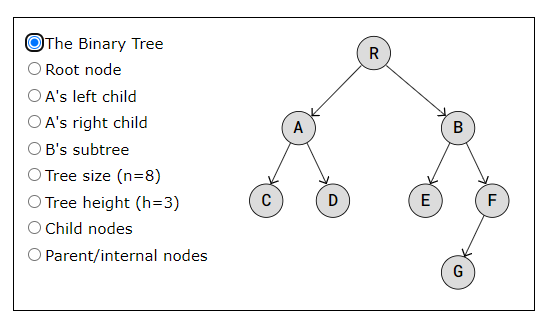
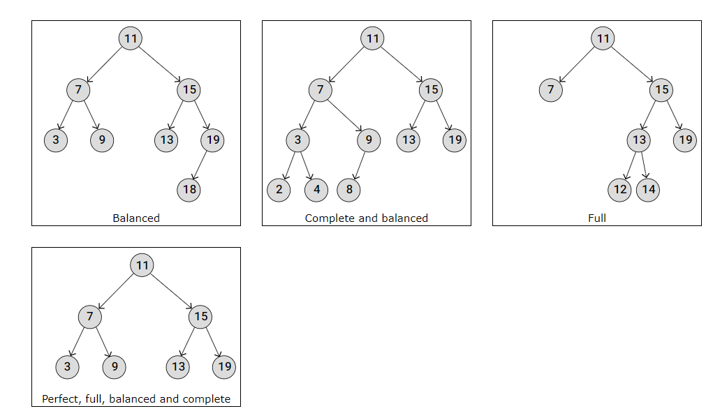

# Binary Trees

* [Binary Trees Study guide](https://leetcode.com/discuss/study-guide/1212004/binary-trees-study-guide)

* Link to read: [Binary Trees W3 Schools](https://www.w3schools.com/dsa/dsa_data_binarytrees.php).

* Link to JavaScript Implementation: [Binary Search Tree Implementation](https://gist.github.com/Prottoy2938/c61a4fa5614c0086952e2464b80136be#file-binarysearchtree-js).

* Link to best video for Solving Binary Tree related programming problems: [How to solve (almost) any binary tree coding problem](https://www.youtube.com/watch?v=s2Yyk3qdy3o)

Note: Please read the above article as I am not gonna repeat it, I will just include the summaries, what I think will help me quickly review.

## Benefits of having two child nodes of each node:
- Algorithms like traversing, searching, insertion and deletion become easier to understand, to implement, and run faster.
- Keeping data sorted in a Binary Search Tree (BST) makes searching very efficient.
- Balancing trees is easier to do with a limited number of child nodes, using an AVL Binary Tree for example.
- Binary Trees can be represented as arrays, making the tree more memory efficient.

## Why Binary Trees over Arrays and Linked Lists?

- In arrays, inserting and deleting operations require shifting other elements, which is in time consuming.
- Linked Lists are also fast in inserting and deleting nodes, no memory shift, but to access an element the list must be traversed, and that takes time.
- Binary Trees, is faster in inserting and deleting operations as compared to Arrays, and faster in accessing an element as compared to LL.

## Types of BT:

## Two Main Categories of Traversing a Binary Tree

- Breadth First Search (BFS)
- Depth First Search (DFS)
    - Three Types of DFS:
        - [pre-order](https://www.w3schools.com/dsa/dsa_algo_binarytrees_preorder.php)
        - [in-order](https://www.w3schools.com/dsa/dsa_algo_binarytrees_inorder.php)
        - [post-order](https://www.w3schools.com/dsa/dsa_algo_binarytrees_postorder.php)

